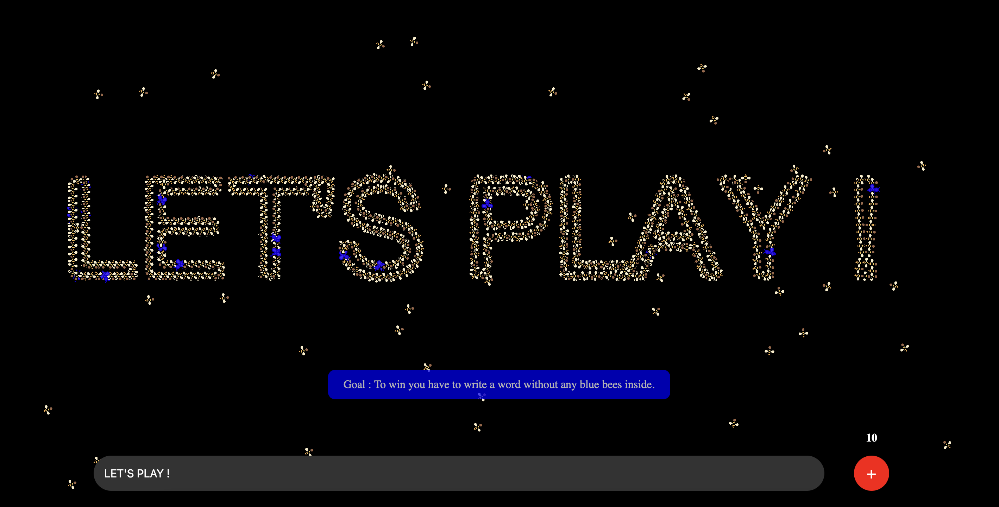

# Bee Chase Game

## Overview

**Bee Chase Game** is an interactive project developed as part of the **Steering Behaviors** course for the second year of the Master's program **MIAGE IA2** at **Université Côte d'Azur**. Authored by **Rafael Baptista**, this game showcases advanced steering behaviors applied to autonomous agents (bees) within a dynamic environment.

The game was developed using **p5.js**, a powerful JavaScript library designed for creative coding. p5.js simplifies the process of creating graphical and interactive experiences, allowing for smooth animations and responsive user interactions essential for the game's mechanics.

## Table of Contents

- [Gameplay](#gameplay)
  - [Starting the Game](#starting-the-game)
  - [Objective](#objective)
  - [Controls](#controls)
    - [Killing Bees](#killing-bees)
    - [Adding More Bees](#adding-more-bees)
- [Bee Points](#bee-points)
- [Victory Condition](#victory-condition)
- [Project Details](#project-details)
- [Technologies Used](#technologies-used)
  - [p5.js](#p5js)
- [Author](#author)
- [License](#license)

## Gameplay

### Starting the Game

Upon launching the Bee Chase Game, you are greeted with a **Start** button centered on the screen. Clicking this button initializes the game by displaying the input box and the "+" button, allowing you to interact with the bee population.

### Objective

The primary goal of the game is to **write a word without any blue bees inside**. This requires strategic management of your bee population and careful interaction to eliminate unwanted blue bees.

## Controls

### Killing Bees

- **Hover Over a Bee**: Move your cursor over a bee to highlight it. Highlighted bees indicate that they are ready to be eliminated.
- **Left-Click to Kill**: Once a bee is highlighted by hovering, perform a left-click to trigger an explosion animation that removes the bee from the game.

### Adding More Bees

- **"+" Button**: Located near the input box, the "+" button allows you to add more bees to your swarm.
- **Bee Points Limitation**: Each press of the "+" button consumes bee points. The number of times you can press the "+" button is limited based on the number of targets derived from your input word.
- **Bee Points Display**: A counter displays the remaining number of times you can add bees. Once depleted, the "+" button is disabled, and a popup notifies you that you are out of bee points.

## Bee Points

Bee points are a crucial resource in the game, determining how many times you can add more bees using the "+" button. To **earn more bee points**, you need to:

1. **Write More**: Input text into the provided input box. The number of targets (points) generated from your input dictates the maximum number of times you can press the "+" button.
2. **Manage Your Swarm**: Strategically kill blue bees to maintain control over your swarm and prevent them from disrupting your target word formation.

## Victory Condition

You achieve victory in the Bee Chase Game under the following conditions:

1. **Non-Empty Input**: Ensure that you have written a word in the input box.
2. **Sufficient Bees**: The number of bees in your swarm must be enough to compose the full input text.
3. **No Blue Bees**: All existing bees in the swarm must **not** be blue. Blue bees indicate a breach in your swarm control.

Upon meeting these conditions:

- **Victory Sequence**: The game adds 500 blue bees to your swarm, updates the input box to display "VICTORY!", and hides all UI elements.
- **Play Again**: A "Play Again" button appears, allowing you to restart the game and attempt a new victory.

## Project Details

- **Course**: Steering Behaviors
- **Program**: Master's in MIAGE IA2
- **Institution**: Université Côte d'Azur
- **Author**: Rafael Baptista

## Technologies Used

### p5.js

**p5.js** is a JavaScript library that makes coding accessible for artists, designers, educators, and beginners. It provides a friendly API for drawing graphics and handling user interactions, which is essential for creating interactive games like Bee Chase.

In **Bee Chase Game**, p5.js is utilized for:

- **Rendering Graphics**: Drawing bees, targets, explosions, and UI elements smoothly and efficiently.
- **Handling Animations**: Managing the movement and behaviors of bees using steering algorithms.
- **User Interaction**: Capturing mouse events for actions like killing bees and adding more bees.
- **Responsive Design**: Ensuring that the game adapts to different screen sizes and window resizes seamlessly.

p5.js's capabilities enable the seamless integration of complex behaviors and interactive elements, providing a rich gaming experience.

## Author

- **LinkedIn**: [Rafael Baptista](https://linkedin.com/in/rafbaptista/)

## License

This project is licensed under the [MIT License](LICENSE).

---